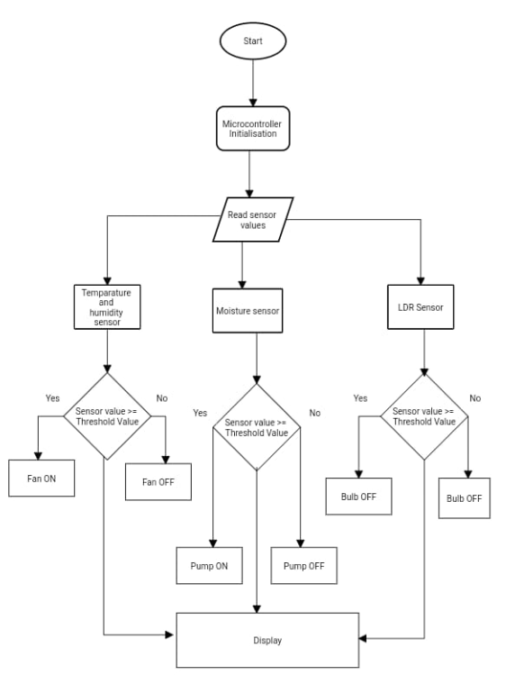
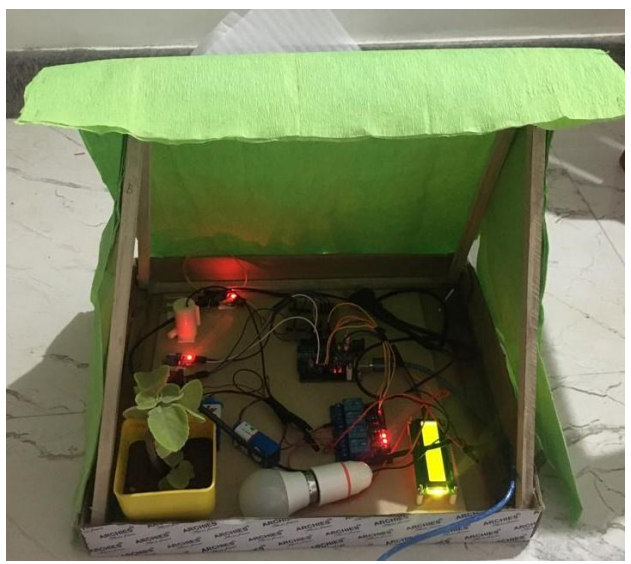

# Automated Greenhouse Monitor & Control System

An Arduino Uno based system that continuously monitors greenhouse conditions — temperature, humidity, light, and soil moisture — and automatically drives actuators (fan, bulb, water pump) to keep the environment within optimal ranges for plant growth, with no manual intervention.

## Project Overview

The system reads four environmental parameters and reacts through threshold-based closed-loop control:
- **DHT11** — temperature and humidity
- **YL-69** — soil moisture
- **LDR** — light intensity
- **16x2 LCD** — live status display

When a parameter crosses its threshold, the Arduino switches the matching actuator through a relay to bring it back into range.

## Block Diagram
[ Temperature sensor ] ─┐ ┌─→ [ Relay → Fan ]
[ Light sensor (LDR) ] ─┤ ├─→ [ Relay → Bulb ]
[ Humidity sensor ] ─┼──→ [ Arduino ]──┼─→ [ Relay → Water Pump ]
[ Soil moisture ] ─┘ Uno └─→ [ 16x2 LCD Display ]

## Control Logic

| Parameter | Sensor | Condition | Action |
|-----------|--------|-----------|--------|
| Temperature | DHT11 | > 27 °C | Fan ON |
| Light | LDR | Low light | Bulb ON |
| Soil moisture | YL-69 | Soil dry | Water pump ON |
| Humidity | DHT11 | > 40 % | Shown on LCD / spray |

## Pin Mapping

| Signal | Arduino Pin |
|--------|-------------|
| LCD (RS, EN, D4, D5, D6, D7) | 2, 3, 4, 5, 6, 7 |
| LDR (light) | A0 |
| DHT11 (temp/humidity) | A1 |
| YL-69 (soil moisture) | A2 |
| Fan relay | D8 |
| Bulb relay | D10 |
| CFL / spray relay | D11 |
| Water pump relay | D12 |

## Flowchart

## Result

The system was built and tested on a physical prototype. When temperature exceeds 27 °C the fan turns on; in low light the bulb turns on; when the soil is dry the pump turns on — all shown live on the LCD.

## Hardware Used

- Arduino Uno (ATmega328P)
- DHT11 temperature & humidity sensor
- YL-69 soil moisture sensor
- LDR (light-dependent resistor)
- 4-channel 5V relay module
- 16x2 LCD display
- DC mini water pump, exhaust fan, bulb
- 9V battery, jumper wires

## Software

- Arduino IDE (sketch: `greenhouse_monitor.ino`)
- Libraries: `LiquidCrystal` (built-in), `DHT sensor library` (Adafruit)

## How to Run

1. Open `greenhouse_monitor.ino` in the Arduino IDE.
2. Install the DHT sensor library (Library Manager → search "DHT sensor library").
3. Wire the sensors and relays per the pin mapping above.
4. Select **Arduino Uno** and the correct COM port, then Upload.
5. Open the Serial Monitor (9600 baud) to watch live readings; the LCD shows the same.

> Note: calibrate `LIGHT_THRESHOLD` and `SOIL_THRESHOLD` for your sensors, and confirm your relay board's polarity (most are active-LOW).

## Author

**Shruddha Metri**

B.E. Electronics & Instrumentation project.

